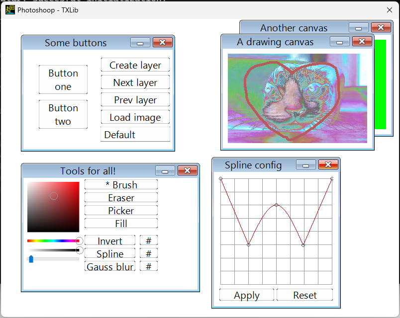

# GUI framework demo

Generally speaking, the code is more impressive than the result here.
There's a lot of small yet significant quality-of-life features here,
like memory-efficient pooled weak pointers, configurable styles or
support for plugins via a standardized interface, established within our group.

## AGF

A GUI framework built atop Windows API and [TXLib](https://github.com/ded32/TXLib), but not using any preexisting widgets from either.

## Photoshoop

A (very unfinished, but still somewhat functional) application for photo editing.

Also see releases for the binary, if you're interested for some reason...
